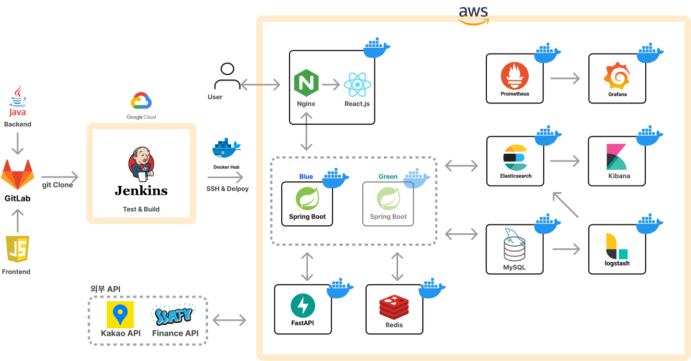

# :rocket:포팅메뉴얼

## 1. 시스템 환경 및 소프트웨어 정보

### 1.1 백엔드 (Spring Boot)
- 프레임워크: Spring boot
- 버전: 3.3.3
- JVM 버전: BellSoft Liberica JDK 17.0.13
- 빌드 도구: Gradle
- IDE: IntelliJ IDEA
- IDE 버전: 2024.1.4

### 1.2 프론트엔드 (React.js / React Native)
- 프레임워크: React.js, React Native
- 버전: 
- 빌드 도구: npm
- IDE: Visual Studio Code 1.90.2

#### 1.2.1 라이브러리
- 

### 1.3 데이터 (FastAPI)
- 프레임워크: Nginx
- 버전: python 3.10.11
- 빌드 도구: uvicorn
- IDE: Visual Studio Code 1.90.2

### 1.4 웹 서버
- 종류: Nginx
- 역할: Reverse Proxy로서 요청을 엔드포인트에 따라 백엔드, 프론트엔드, 데이터로 구분하여 처리

### 1.5 WAS
- 설정 파일: `application.yml`
    - application.yml 내용
        ```yml
        spring:
        application:
            name: cardmore
        jackson:
            time-zone: Asia/Seoul
        jpa:
            hibernate:
            ddl-auto: update
            properties:
            hibernate:
                format_sql: true
                default_batch_fetch_size: 1000
                jdbc:
                time_zone: Asia/Seoul
        datasource:
            url: ${DATASOURCE_URL}
            username: ${DATASOURCE_USERNAME}
            password: ${DATASOURCE_PASSWORD}
        data:
            elasticsearch:
            url: ${ELASTICSEARCH_URL}:${ELASTICSEARCH_PORT}
            repositories:
                enabled: true
            redis:
            host: ${REDIS_HOST}
            port: ${REDIS_PORT}
            password: ${REDIS_PASSWORD}
            data:
            elasticsearch:
                client:
                config:
                    uris: http://localhost:9200

        ai:
        url: ${AI_URL}

        jwt:
        secret-key: ${SECRET_KEY}
        access-token-exp: ${ACCESS_TOKEN_EXP}
        refresh-token-exp: ${REFRESH_TOKEN_EXP}

        fintech:
        api:
            url: ${FINTECH_API_URL}
            key: ${FINTECH_API_KEY}
        app:
            no: ${FINTECH_API_NO}
        institution:
            code: ${FINTECH_INSTITUTION_CODE}

        springdoc:
        default-consumes-media-type: application/json;charset=UTF-8
        api-docs:
            enabled: true
            path: '/docs'
        swagger-ui:
            enabled: true
            path: '/swagger'
            try-it-out-enabled: true
            operations-sorter: alpha

        logging:
        level:
            a107.cardmore: debug
            org.springframework.data.elasticsearch.client: DEBUG
            org.elasticsearch.client: DEBUG

        management:
        endpoints:
            web:
            exposure:
                include: health, info, prometheus
        endpoint:
            prometheus:
            enabled: true

        fcm:
        private-key: ${FCM_PRIVATE_KEY}
        client-email: ${FCM_CLIENT_EMAIL}
        token: ${FCM_TOKEN}
        ```
- 민감 정보는 환경변수 주입으로 관리하였습니다.
- 종류: Spring Boot 3.0.0 내장 Tomcat
- 포트: 8080 (내장 Tomcat 기본 포트)

### 1.6 인프라 구성

#### 1.6.1 구조


#### 1.6.2 EC2 인스턴스
- 역할: Docker를 이용한 Nginx와 서비스 서버(Spring Boot, React.js, FastAPI), DB 및 모니터링 툴 도커 컨테이너의 실행
- 설치된 소프트웨어: Docker

#### 1.6.3 DB

##### RDS
- **MySQL**
    - docker-compose.yml
        ```yml
            version: '3.8'

            services:
            mysql:
                image: mysql:8.0
                container_name: mysql
                restart: unless-stopped
                ports:
                - "3306:3306"
                environment:
                MYSQL_ROOT_PASSWORD: ssa402fy
                MYSQL_DATABASE: cardo
                volumes:
                - mysql_data:/var/lib/mysql
                - ./my.cnf:/etc/mysql/my.cnf:ro

            networks:
            default:
                name: cardo-network
                external: true

            volumes:
            mysql_data: {}
        ```
    - my.cnf
        ```cnf
            [mysqld]
            bind-address = 0.0.0.0
            character-set-server = utf8mb4
            collation-server = utf8mb4_unicode_ci
        ```

##### NoSQL
- **Redis**
    - docker-compose.yml
        ```yml
            version: '3.9'

            services:
            redis:
                image: redis:7.4
                container_name: redis
                command: redis-server --requirepass ${REDISCLI_AUTH} --appendonly yes
                ports:
                - "6379:6379"
                volumes:
                - redis-data:/data

            networks:
            default:
                name: cardo-network
                external: true

            volumes:
            redis-data:
        ```

- **ELK 스택**
    - docker-compose.yml
        ```yml
            version: "3.8"

            volumes:
            esdata01:
                driver: local
            kibanadata:
                driver: local
            logstashdata01:
                driver: local

            networks:
            default:
                name: cardo-network
                external: true

            services:
            es01:
                image: docker.elastic.co/elasticsearch/elasticsearch:${STACK_VERSION}
                container_name: es01
                restart: unless-stopped
                labels:
                co.elastic.logs/module: elasticsearch
                volumes:
                - esdata01:/usr/share/elasticsearch/data
                ports:
                - ${ES_PORT}:9200
                environment:
                - node.name=es01
                - cluster.name=${CLUSTER_NAME}
                - discovery.type=single-node
                - bootstrap.memory_lock=true
                - xpack.security.enabled=false  # Disable security
                mem_limit: ${ES_MEM_LIMIT}
                logging:
                options:
                    max-size: "10m"
                    max-file: "3"
                ulimits:
                memlock:
                    soft: -1
                    hard: -1
                healthcheck:
                test:
                    [
                    "CMD-SHELL",
                    "curl -s http://localhost:9200 | grep -q 'You Know, for Search'",
                    ]
                interval: 10s
                timeout: 10s
                retries: 120

            kibana:
                depends_on:
                es01:
                    condition: service_healthy
                image: docker.elastic.co/kibana/kibana:${STACK_VERSION}
                container_name: kibana
                labels:
                co.elastic.logs/module: kibana
                volumes:
                - kibanadata:/usr/share/kibana/data
                ports:
                - ${KIBANA_PORT}:5601
                environment:
                - SERVERNAME=kibana
                - ELASTICSEARCH_HOSTS=http://es01:9200
                mem_limit: ${KB_MEM_LIMIT}
                logging:
                options:
                    max-size: "10m"
                    max-file: "3"
                healthcheck:
                test:
                    [
                    "CMD-SHELL",
                    "curl -s -I http://localhost:5601 | grep -q 'HTTP/1.1 302 Found'",
                    ]
                interval: 10s
                timeout: 10s
                retries: 120

            logstash01:
                depends_on:
                es01:
                    condition: service_healthy
                kibana:
                    condition: service_healthy
                image: docker.elastic.co/logstash/logstash:${STACK_VERSION}
                container_name: logstash
                labels:
                co.elastic.logs/module: logstash
                volumes:
                - logstashdata01:/usr/share/logstash/data
                - "./logstash.conf:/usr/share/logstash/pipeline/logstash.conf:ro"
                - "./mysql-connector-java-8.0.29.jar:/usr/share/logstash/logstash-core/lib/jars/mysql-connector-java-8.0.29.jar"  # JDBC 드라이버 추가
                environment:
                - xpack.monitoring.enabled=false  # Disable monitoring
                - ELASTIC_HOSTS=http://es01:9200
                logging:
                options:
                    max-size: "10m"
                    max-file: "3"
        ```

## 2. 빌드 및 배포

### 2.1 Docker 빌드

#### 2.1.1 백엔드 Dockerfile (Spring Boot)

```Dockerfile
FROM openjdk:17
COPY build/libs/*.jar app.jar
EXPOSE 8080
ENTRYPOINT ["java","-jar","-Duser.timezone=Asia/Seoul","app.jar"]
```

#### 2.1.2 프론트엔드 Dockerfile (React.js)

```Dockerfile
    # react-dockerizing/Dockerfile

    # base image 설정(as build 로 완료된 파일을 밑에서 사용할 수 있다.)
    FROM node:20 as build

    # 컨테이너 내부 작업 디렉토리 설정
    WORKDIR /app

    # app dependencies
    # 컨테이너 내부로 package.json 파일들을 복사
    COPY package*.json ./

    # package.json 및 package-lock.json 파일에 명시된 의존성 패키지들을 설치
    RUN npm install

    # 호스트 머신의 현재 디렉토리 파일들을 컨테이너 내부로 전부 복사
    COPY . .

    # npm build
    RUN npm run build

    # prod environment
    FROM nginx:stable-alpine

    # 이전 빌드 단계에서 빌드한 결과물을 /usr/share/nginx/html 으로 복사한다.
    COPY --from=build /app/build /usr/share/nginx/html

    # 기본 nginx 설정 파일을 삭제한다. (custom 설정과 충돌 방지)
    RUN rm /etc/nginx/conf.d/default.conf

    # custom 설정파일을 컨테이너 내부로 복사한다.
    COPY nginx/nginx.conf /etc/nginx/conf.d

    # 컨테이너의 80번 포트를 열어준다.
    EXPOSE 80

    # nginx 서버를 실행하고 백그라운드로 동작하도록 한다.
    CMD ["nginx", "-g", "daemon off;"]
```

#### 2.1.3 데이터 Dockerfile (FastAPI)

```Dockerfile
# 1. Python 3.10 이미지로 시작
FROM python:3.10-slim

# 2. 작업 디렉터리 설정
WORKDIR /app

# 3. 필요한 패키지 설치 (pip 최신 버전으로 업그레이드)
RUN python -m pip install --upgrade pip

# 4. 의존성 설치 (requirements.txt 파일을 /app 폴더로 복사하고 설치)
COPY requirements.txt .
RUN pip install --no-cache-dir -r requirements.txt

# 5. 애플리케이션 소스 코드 복사
COPY . .

# 6. 포트 노출
EXPOSE 8000

# 7. FastAPI 서버 실행 명령어 추가
CMD ["uvicorn", "app:app", "--host", "0.0.0.0", "--port", "8000"]
```

### 2.2 docker-compose.yml 정의

#### 2.2.1 백엔드 docker-compose.yml
- blue 인스턴스
    ```yml
    version: '3.8'

    services:
    backend:
        image: jounghs3933/cardo-be:latest
        container_name: cardo-be-blue
        env_file:
        - .env.blue
        ports:
        - 8081:8080
        logging:
        options:
            max-size: "10m"
            max-file: "3"

    networks:
    default:
        name: cardo-network
        external: true
    ```

- green 인스턴스
    ```yml
    version: '3.8'

    services:
    backend:
        image: jounghs3933/cardo-be:latest
        container_name: cardo-be-green
        env_file:
        - .env.green
        ports:
        - 8082:8080
        logging:
        options:
            max-size: "10m"
            max-file: "3"

    networks:
    default:
        name: cardo-network
        external: true
    ```

#### 2.2.2 프론트엔드 docker-compose.yml
```yml
version: '3.8'

services:
  backend:
    image: jounghs3933/cardo-fe:latest
    container_name: cardo-fe
    ports:
      - 80:80
      - 443:443
    logging:
      options:
        max-size: "10m"
        max-file: "3"

networks:
  default:
    name: cardo-network
    external: true
```

#### 2.2.3 데이터 docker-compose.yml
```yml
version: '3.8'

services:
  ai:
    image: jounghs3933/cardo-ai:latest
    container_name: cardo-ai
    ports:
      - 8000:8000
    logging:
      options:
        max-size: "10m"
        max-file: "3"

networks:
  default:
    name: cardo-network
    external: true
```

### 2.3 Jenkins CI/CD 구축

#### 2.3.1 백엔드 파이프라인

<details>
    <summary>Jenkinsfile</summary>

    pipeline {
        agent any

        environment{
            // GitLab
            GIT_BRANCH = "be/dev"
            GIT_URL = "https://lab.ssafy.com/s11-final/S11P31A402.git"
            GIT_CREDENTIALS_ID = 'gitlab-login-credentials'

            // Docker hub
            DOCKER_HUB_CREDENTIALS = credentials("docker-hub-credentials")
            DOCKER_IMAGE_NAME = "cardo-be"
            DOCKER_IMAGE_TAG = "latest"
            DOCKER_REGISTRY = "jounghs3933"

            // Deploy Server
            REMOTE_HOST = "k11a402.p.ssafy.io"
            REMOTE_USER = "ubuntu"
            SSH_CREDENTIALS_ID = "k11a402-ssh-credentials"
            TARGET_DIRECTORY = "/home/ubuntu/backend"

            // .env file
            SECRET_ENV_FILE_ID = "k11a402-be-env-file"
        }

        stages {
            stage('Git Checkout') {
                steps {
                    script {
                        echo "Start cloning git project..."
                        try {
                            git branch: GIT_BRANCH, 
                                url: GIT_URL, 
                                credentialsId: GIT_CREDENTIALS_ID
                        } catch (err) {
                            echo "Error during cloning git project: ${err}"
                            error("The Git Checkout stage failed...")
                        }
                        echo "Git project was cloned successfully."
                    }
                }
                
            }

            stage('Apply Env & Build') {
                steps {
                    withCredentials([file(credentialsId: SECRET_ENV_FILE_ID, variable: 'ENV_FILE')]) {
                        script {
                            echo "Start building spring project..."
                            try {
                                def envVars = readFile(env.ENV_FILE).split('\n')
                                .findAll { it.trim() && !it.startsWith('#') }
                                .collect { line ->
                                    def (key, value) = line.split('=', 2)
                                    "${key.trim()}=${value.trim()}"
                                }

                                withEnv(envVars) {
                                    sh """
                                        chmod +x ./gradlew
                                        ./gradlew clean build -x test
                                    """
                                }
                            } catch (err) {
                                echo "Error during building spring project: ${err}"
                                cleanWs()
                                error("The Build with Gradle stage failed...")
                            }
                            echo "Project was built successfully."
                        }
                    }
                }
            }

            stage("Build Docker Image") {
                steps {
                    script {
                        echo "Start building Docker image..."
                        try {
                            sh "docker build -t ${DOCKER_REGISTRY}/${DOCKER_IMAGE_NAME}:${DOCKER_IMAGE_TAG} ."
                        } catch (err) {
                            echo "Error during building docker image: ${err}"
                            cleanWs()
                            error("The Build Docker Image stage failed...")
                        }
                        echo "Docker image was built successfully."
                    }
                }
            }

            stage("DockerHub Upload") {
                steps{
                    script{
                        echo "Start uploading to docker hub..."
                        try {
                            script {
                                sh """
                                    echo $DOCKER_HUB_CREDENTIALS_PSW | docker login -u $DOCKER_HUB_CREDENTIALS_USR --password-stdin
                                    docker push ${DOCKER_REGISTRY}/${DOCKER_IMAGE_NAME}:${DOCKER_IMAGE_TAG}
                                    docker rmi ${DOCKER_REGISTRY}/${DOCKER_IMAGE_NAME}:${DOCKER_IMAGE_TAG}
                                """
                            }
                        } catch (err) {
                            echo "Error during uploading to docker hub: ${err}"
                            error("The DockerHub Upload stage failed...")
                        }
                        echo "Docker image was uploaded to docker hub successfully."
                    }
                }
            }

            stage('Deploy to Dev Server') {
                steps {
                    script{
                        echo "Start deploying project into dev server..."
                        try {
                            withCredentials([file(credentialsId: SECRET_ENV_FILE_ID, variable: 'ENV_FILE')]) {
                                sshagent(credentials: [SSH_CREDENTIALS_ID]) {
                                    sh """
                                    scp -o StrictHostKeyChecking=no $ENV_FILE ${REMOTE_USER}@${REMOTE_HOST}:${TARGET_DIRECTORY}/.env
                                    ssh -o StrictHostKeyChecking=no ${REMOTE_USER}@${REMOTE_HOST} '
                                        echo $DOCKER_HUB_CREDENTIALS_PSW | docker login -u $DOCKER_HUB_CREDENTIALS_USR --password-stdin
                                        cd ${TARGET_DIRECTORY}
                                        docker-compose pull
                                        docker-compose up -d
                                        docker image prune -f
                                    '
                                    """
                                }
                            }
                        } catch (err) {
                            echo "Error during deploying into dev server: ${err}"
                            error("The Deploy to Dev Server stage failed...")
                        }
                        echo "Project was deployed successfully."
                    }
                }
            }
        }

        post {
            success {
                script{
                    def Author_ID = sh(script: "git show -s --pretty=%an", returnStdout: true).trim()
                    def Author_Name = sh(script: "git show -s --pretty=%ae", returnStdout: true).trim()
                    mattermostSend (
                        color: 'good', 
                        message: "빌드 성공: ${env.JOB_NAME} #${env.BUILD_NUMBER} by ${Author_ID}(${Author_Name})\n(<${env.BUILD_URL}|Details>)", 
                    )
                    cleanWs()
                }
            }
            failure {
                script{
                    def Author_ID = sh(script: "git show -s --pretty=%an", returnStdout: true).trim()
                    def Author_Name = sh(script: "git show -s --pretty=%ae", returnStdout: true).trim()
                    mattermostSend (
                        color: 'danger', 
                        message: "빌드 실패: ${env.JOB_NAME} #${env.BUILD_NUMBER} by ${Author_ID}(${Author_Name})\n(<${env.BUILD_URL}|Details>)", 
                    )
                    cleanWs()
                }
            }
        }
    }
</details>


#### 2.3.2 프론트엔드 파이프라인

<details>
    <summary>Jenkinsfile</summary>

    pipeline {
        agent any

        environment{
            // GitLab
            GIT_BRANCH = "fe/dev"
            GIT_URL = "https://lab.ssafy.com/s11-final/S11P31A402.git"
            GIT_CREDENTIALS_ID = 'gitlab-login-credentials'

            // Docker hub
            DOCKER_IMAGE_NAME = "cardo-fe"
            DOCKER_IMAGE_TAG = "latest"
            DOCKER_REGISTRY = "jounghs3933"

            // Deploy Server
            REMOTE_HOST = "k11a402.p.ssafy.io"
            REMOTE_USER = "ubuntu"
            SSH_CREDENTIALS_ID = "k11a402-ssh-credentials"
            TARGET_DIRECTORY = "/home/ubuntu/frontend"

            SECRET_ENV_FILE_ID = "k11a402-fe-env-file"
        }

        stages {
            stage('Git Checkout') {
                steps {
                    script {
                        echo "Start cloning git project..."
                        try {
                            git branch: GIT_BRANCH, 
                                url: GIT_URL, 
                                credentialsId: GIT_CREDENTIALS_ID
                        } catch (err) {
                            echo "Error during cloning git project: ${err}"
                            error("The Git Checkout stage failed...")
                        }
                        echo "Git project was cloned successfully."
                    }
                }
                
            }

            stage('Insert Env') {
                steps {
                    withCredentials([file(credentialsId: SECRET_ENV_FILE_ID, variable: 'ENV_FILE')]) {
                        script {
                            echo "Copy env in project"
                            try {
                                sh "cp ${ENV_FILE} .env"
                            } catch (err) {
                                echo "Error during copying env in project: ${err}"
                                cleanWs()
                                error("The Insert Env stage failed...")
                            }
                            echo "Env file was copied successfully."
                        }
                    }
                }
            }

            stage("Build Docker Image") {
                steps {
                    script {
                        echo "Start building Docker image..."
                        try {
                            sh "docker build -t ${DOCKER_REGISTRY}/${DOCKER_IMAGE_NAME}:${DOCKER_IMAGE_TAG} ."
                        } catch (err) {
                            echo "Error during building docker image: ${err}"
                            cleanWs()
                            error("The Build Docker Image stage failed...")
                        }
                        echo "Docker image was built successfully."
                    }
                }
            }

            stage("DockerHub Upload") {
                steps{
                    script{
                        echo "Start uploading to docker hub..."
                        try {
                            script {
                                sh """
                                    docker push ${DOCKER_REGISTRY}/${DOCKER_IMAGE_NAME}:${DOCKER_IMAGE_TAG}
                                    docker rmi ${DOCKER_REGISTRY}/${DOCKER_IMAGE_NAME}:${DOCKER_IMAGE_TAG}
                                """
                            }
                        } catch (err) {
                            echo "Error during uploading to docker hub: ${err}"
                            error("The DockerHub Upload stage failed...")
                        }
                        echo "Docker image was uploaded to docker hub successfully."
                    }
                }
            }

            stage('Deploy to Dev Server') {
                steps {
                    script{
                        echo "Start deploying project into dev server..."
                        try {
                            sshagent(credentials: [SSH_CREDENTIALS_ID]) {
                                sh """
                                ssh -o StrictHostKeyChecking=no ${REMOTE_USER}@${REMOTE_HOST} '
                                    cd ${TARGET_DIRECTORY}
                                    docker-compose pull
                                    docker-compose up -d
                                    docker image prune -f
                                '
                                """
                            }
                        } catch (err) {
                            echo "Error during deploying into dev server: ${err}"
                            error("The Deploy to Dev Server stage failed...")
                        }
                        echo "Project was deployed successfully."
                    }
                }
            }
        }

        post {
            success {
                script{
                    def Author_ID = sh(script: "git show -s --pretty=%an", returnStdout: true).trim()
                    def Author_Name = sh(script: "git show -s --pretty=%ae", returnStdout: true).trim()
                    mattermostSend (
                        color: 'good', 
                        message: "빌드 성공: ${env.JOB_NAME} #${env.BUILD_NUMBER} by ${Author_ID}(${Author_Name})\n(<${env.BUILD_URL}|Details>)", 
                    )
                    cleanWs()
                }
            }
            failure {
                script{
                    def Author_ID = sh(script: "git show -s --pretty=%an", returnStdout: true).trim()
                    def Author_Name = sh(script: "git show -s --pretty=%ae", returnStdout: true).trim()
                    mattermostSend (
                        color: 'danger', 
                        message: "빌드 실패: ${env.JOB_NAME} #${env.BUILD_NUMBER} by ${Author_ID}(${Author_Name})\n(<${env.BUILD_URL}|Details>)", 
                    )
                    cleanWs()
                }
            }
        }
    }

</details>

#### 2.3.3 데이터 파이프라인

<details>
    <summary>Jenkinsfile</summary>

    pipeline {
        agent any

        environment{
            // GitLab
            GIT_BRANCH = "ai/dev"
            GIT_URL = "https://lab.ssafy.com/s11-final/S11P31A402.git"
            GIT_CREDENTIALS_ID = 'gitlab-login-credentials'

            // Docker hub
            DOCKER_IMAGE_NAME = "cardo-ai"
            DOCKER_IMAGE_TAG = "latest"
            DOCKER_REGISTRY = "jounghs3933"

            // Deploy Server
            REMOTE_HOST = "k11a402.p.ssafy.io"
            REMOTE_USER = "ubuntu"
            SSH_CREDENTIALS_ID = "k11a402-ssh-credentials"
            TARGET_DIRECTORY = "/home/ubuntu/ai"
        }

        stages {
            stage('Git Checkout') {
                steps {
                    script {
                        echo "Start cloning git project..."
                        try {
                            git branch: GIT_BRANCH, 
                                url: GIT_URL, 
                                credentialsId: GIT_CREDENTIALS_ID
                        } catch (err) {
                            echo "Error during cloning git project: ${err}"
                            error("The Git Checkout stage failed...")
                        }
                        echo "Git project was cloned successfully."
                    }
                }
            }

            stage("Build Docker Image") {
                steps {
                    script {
                        echo "Start building Docker image..."
                        try {
                            sh "docker build -t ${DOCKER_REGISTRY}/${DOCKER_IMAGE_NAME}:${DOCKER_IMAGE_TAG} ."
                        } catch (err) {
                            echo "Error during building docker image: ${err}"
                            cleanWs()
                            error("The Build Docker Image stage failed...")
                        }
                        echo "Docker image was built successfully."
                    }
                }
            }

            stage("DockerHub Upload") {
                steps{
                    script{
                        echo "Start uploading to docker hub..."
                        try {
                            script {
                                sh """
                                    docker push ${DOCKER_REGISTRY}/${DOCKER_IMAGE_NAME}:${DOCKER_IMAGE_TAG}
                                    docker rmi ${DOCKER_REGISTRY}/${DOCKER_IMAGE_NAME}:${DOCKER_IMAGE_TAG}
                                """
                            }
                        } catch (err) {
                            echo "Error during uploading to docker hub: ${err}"
                            error("The DockerHub Upload stage failed...")
                        }
                        echo "Docker image was uploaded to docker hub successfully."
                    }
                }
            }

            stage('Deploy to Dev Server') {
                steps {
                    script{
                        echo "Start deploying project into dev server..."
                        try {
                            sshagent(credentials: [SSH_CREDENTIALS_ID]) {
                                sh """
                                ssh -o StrictHostKeyChecking=no ${REMOTE_USER}@${REMOTE_HOST} '
                                    cd ${TARGET_DIRECTORY}
                                    docker-compose pull
                                    docker-compose up -d
                                    docker image prune -f
                                '
                                """
                            }
                        } catch (err) {
                            echo "Error during deploying into dev server: ${err}"
                            error("The Deploy to Dev Server stage failed...")
                        }
                        echo "Project was deployed successfully."
                    }
                }
            }
        }

        post {
            success {
                script{
                    def Author_ID = sh(script: "git show -s --pretty=%an", returnStdout: true).trim()
                    def Author_Name = sh(script: "git show -s --pretty=%ae", returnStdout: true).trim()
                    mattermostSend (
                        color: 'good', 
                        message: "빌드 성공: ${env.JOB_NAME} #${env.BUILD_NUMBER} by ${Author_ID}(${Author_Name})\n(<${env.BUILD_URL}|Details>)", 
                    )
                    cleanWs()
                }
            }
            failure {
                script{
                    def Author_ID = sh(script: "git show -s --pretty=%an", returnStdout: true).trim()
                    def Author_Name = sh(script: "git show -s --pretty=%ae", returnStdout: true).trim()
                    mattermostSend (
                        color: 'danger', 
                        message: "빌드 실패: ${env.JOB_NAME} #${env.BUILD_NUMBER} by ${Author_ID}(${Author_Name})\n(<${env.BUILD_URL}|Details>)", 
                    )
                    cleanWs()
                }
            }
        }
    }

</details>
